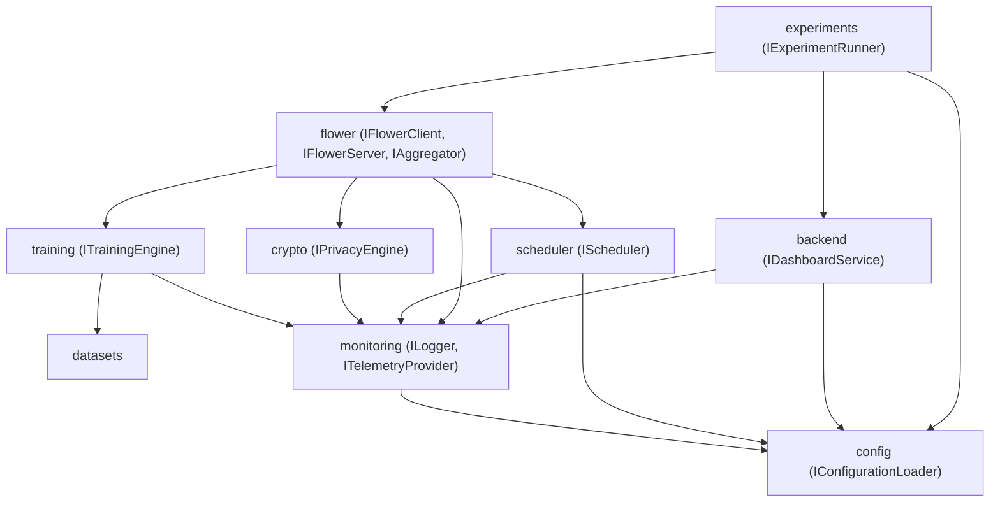
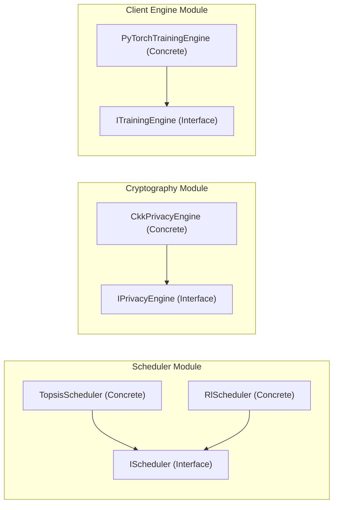
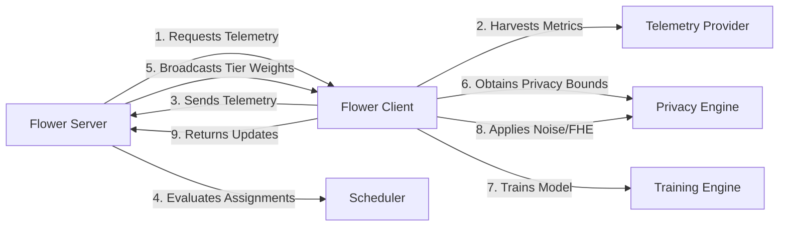
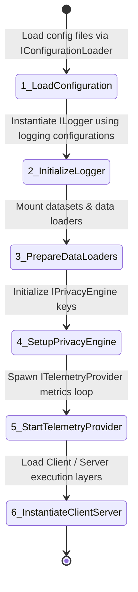
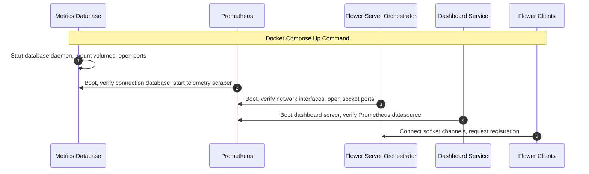
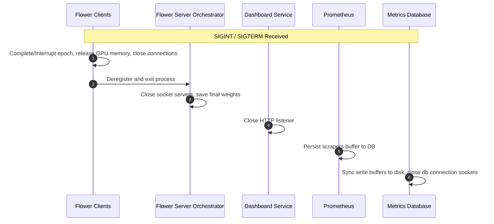
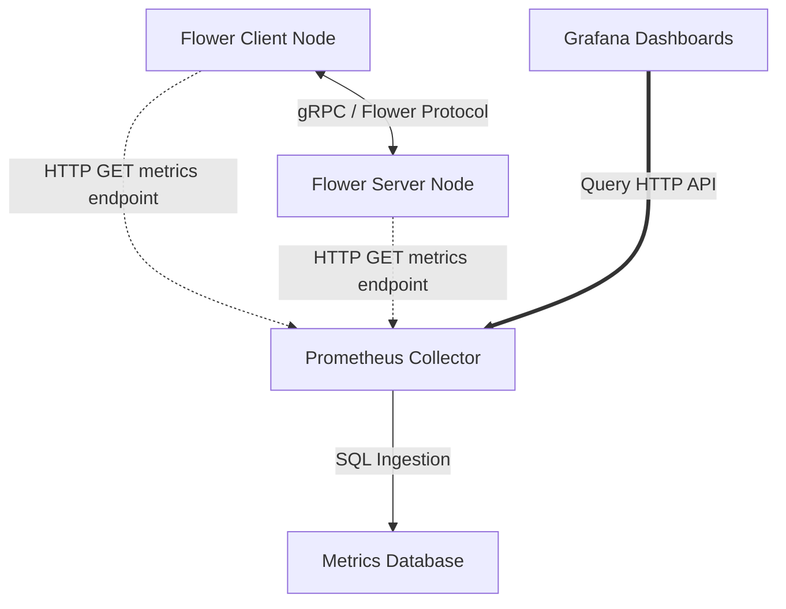

# System Dependency Graphs & Sequences

This document maps out package, module, import, and runtime dependencies, along with system lifecycles and communication paths for the Resource-Aware Tiered Clustering (RATC) project. It establishes structural isolation to ensure there are **no cyclic dependencies**.

---

## 1. Package Dependency Graph
The high-level coupling between directory modules. System dependency is unidirectional, flowing down to core utilities (`monitoring`, `config`, `datasets`).



---

## 2. Module Dependency Graph
The relationship within modules showing how concrete implementations depend exclusively on interfaces.



---

## 3. Import Dependency Graph
Guidelines for Python file imports to prevent circular importing.

```
[Concrete Client Code]
     │
     ▼ (imports)
[Module Interfaces]
     │
     ▼ (imports)
[Data Containers / Dataclasses] (e.g. TelemetryVector, ModelUpdate)
     │
     ▼ (imports)
[Standard Types / typing]
```
*Rule:* Modules never import concrete classes from other modules directly. They only import interfaces or data model definitions (e.g., `TelemetryVector`).

---

## 4. Runtime Dependency Graph
Defines data flows and interactions between running instances.



---

## 5. System Initialization Order
The sequence of object instantiations when booting a node.



---

## 6. Service Startup Order
The sequence in which independent Docker containers and backend processes are spun up.



---

## 7. Shutdown Order
The sequence for executing clean teardowns of running processes to avoid data corruption or resource locks.



---

## 8. Communication Graph
The channels and protocols through which components share data.


*Note:* Dashed lines represent scrape queries, solid lines indicate data transport, and triple lines represent client-facing queries.
